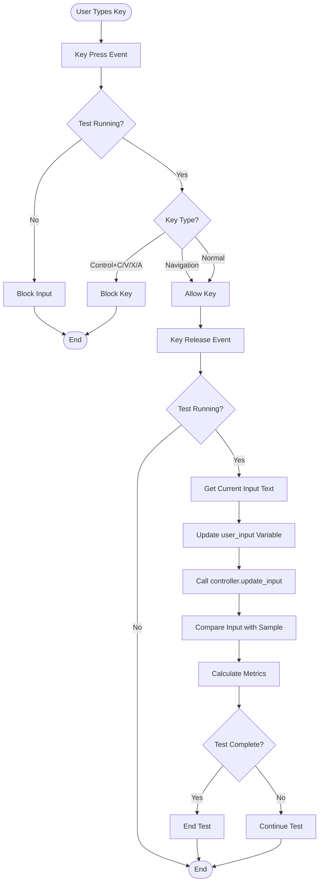

# Typing Speed Test Application - Flowchart

## Main Application Flow


## Test Controller Flow


## Input Processing Flow



## Results Display Flow


## Text Generation Flow


## ASCII Art Flowchart (Alternative Format)

```
┌─────────────────────────────────────────────────────────────┐
│                    APPLICATION START                         │
└──────────────────────┬──────────────────────────────────────┘
                       │
                       ▼
              ┌─────────────────┐
              │ Initialize App  │
              └────────┬────────┘
                       │
                       ▼
              ┌─────────────────┐
              │   Create UI      │
              └────────┬────────┘
                       │
                       ▼
              ┌─────────────────┐
              │  Load Sample    │
              │      Text       │
              └────────┬────────┘
                       │
                       ▼
              ┌─────────────────┐
              │  Wait for User   │
              │     Action      │
              └────────┬────────┘
                       │
        ┌──────────────┼──────────────┐
        │              │              │
        ▼              ▼              ▼
   [Start]        [Reset]      [Change Mode]
        │              │              │
        ▼              ▼              ▼
   ┌─────────┐   ┌─────────┐   ┌─────────┐
   │ Start   │   │ Reset   │   │ Reload  │
   │  Test   │   │  Test   │   │  Text   │
   └────┬────┘   └────┬────┘   └────┬────┘
        │             │              │
        │             └──────┬───────┘
        │                    │
        ▼                    ▼
   ┌─────────┐         ┌─────────┐
   │ Enable  │         │  Wait   │
   │  Input  │         │  Loop   │
   └────┬────┘         └─────────┘
        │
        ▼
   ┌─────────┐
   │  User   │
   │  Types  │
   └────┬────┘
        │
        ▼
   ┌─────────┐
   │ Compare │
   │  Input  │
   └────┬────┘
        │
        ▼
   ┌─────────┐
   │ Check   │
   │  Mode   │
   └────┬────┘
        │
   ┌────┴────┐
   │         │
   ▼         ▼
┌─────┐  ┌─────┐
│Time │  │Text │
│Limit│  │Done │
└──┬──┘  └──┬──┘
   │        │
   └───┬────┘
       │
       ▼
   ┌─────────┐
   │  End    │
   │  Test   │
   └────┬────┘
        │
        ▼
   ┌─────────┐
   │  Show   │
   │ Results │
   └────┬────┘
        │
        ▼
   ┌─────────┐
   │  Wait   │
   │  Loop   │
   └─────────┘
```

